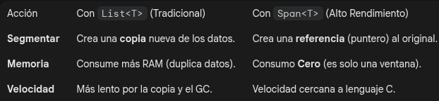

# Span<T> vs Memory <T>

Span<T>: Solo puede usarse en métodos sincronizados y locales (en el Stack). Es el más rápido.

Memory<T>: Es el "hermano mayor". Se puede guardar en clases o usar en métodos asíncronos (async/await). Si vas a procesar millones de registros de forma asíncrona, usarás este.

Span y memory no son colecciones, sino vistas sobre los datos que ya están en una colección.

- La colección (list, Array) es el almacén físico donde están las cajas (los datos).
- Span<T>: Es una linterna: Tú apuntas con la linterna a una sección específica del almacén. La linterna no contiene las cajas, solo te permite verlas y trabajar con ellas sin moverlas de su sitio.
- No son funciones, son tipos de datos (estructuras) que envuelven una colección existente. Se usa para pasar fragementos de datos entre funciones de forma ultra eficiente.

ReadOnlySpan<T> y ReadOnlyMemory<T>
Son las versiones de "solo lectura" de lo que vimos antes. Cuando procesas millones de registros, quieres asegurarte de que ninguna función intermedia modifique tus datos por error. Es el estándar de seguridad en arquitecturas robustas.